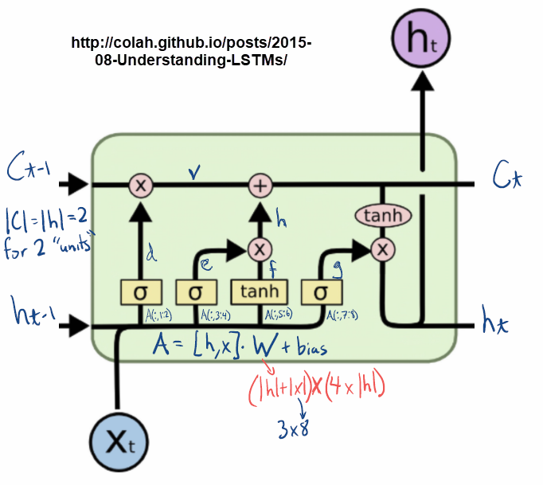
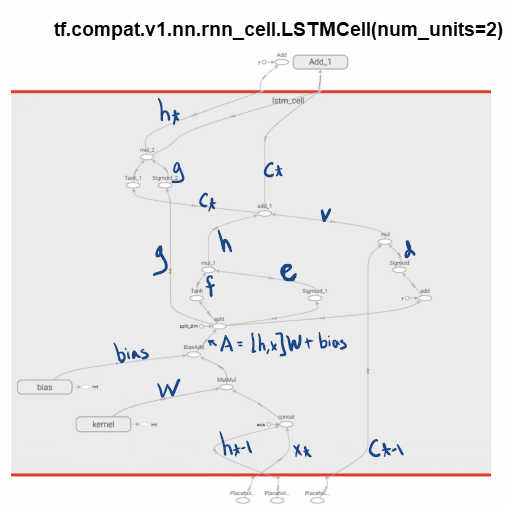

In [first.py](first.py) I was experminting with the most basic tensorflow LSTM block: ``tf.compat.v1.nn.rnn_cell.LSTMCell``.
I'm just doing this to understand how tensorflow is implementing the math described [here](http://colah.github.io/posts/2015-08-Understanding-LSTMs/):

This is how its mapped in Tensorflow (using Tensorboard to view the computation graph):

